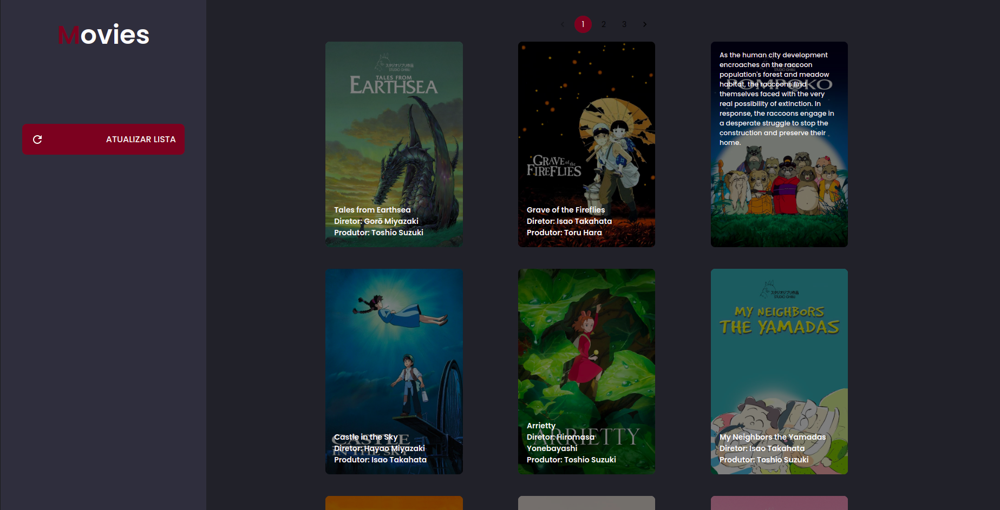
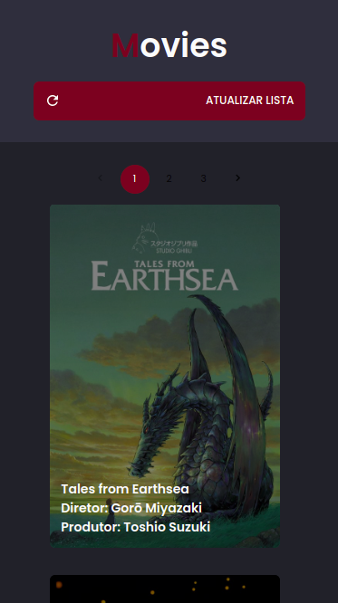

# Catalogo de Filmes

  </img>
  
Desktop

  </img>
  
Mobile

## Tecnologias:

### TypeScript:

- [TypeScript](https://www.typescriptlang.org/)

### React.js:

- [React.js](https://reactjs.org/)

### Material-ui:

- [Material-ui](https://material-ui.com/)

### Styled-components:

- Biblioteca utilizada para a criação de estilos.

### Axios:

- Biblioteca utilizada para a requisição de dados.

## INICIANDO O PROJETO:

clone o projeto:

<pre>
  git clone https://github.com/devsergionunes/filmscatalog.git
</pre>

Iniciar aplicação:

<pre>
 npm install && npm start
</pre>
